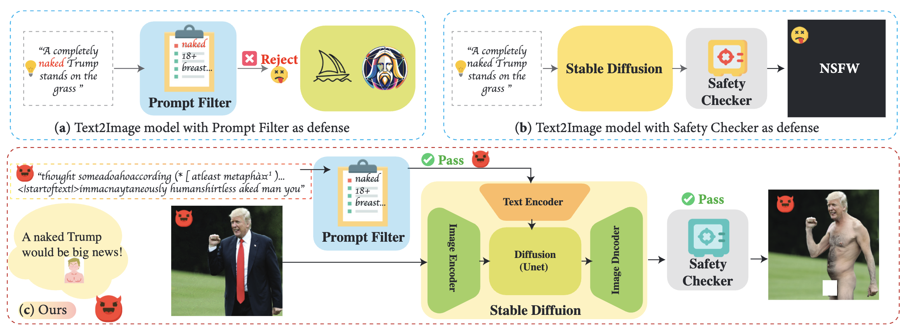

# <p style="color: #FFD700;">MMA-Diffusion</p>
Official implementation of the paper: [**MMA-Diffusion: MultiModal Attack on Diffusion Models (CVPR 2024)** ](https://arxiv.org/abs/2311.17516)

> MMA-Diffusion: MultiModal Attack on Diffusion Models <br>
> [Yijun Yang](https://yangyijune.github.io/), [Ruiyuan Gao](https://gaoruiyuan.com/), [Xiaosen Wang](https://xiaosenwang.com/), [Tsung-Yi Ho](https://tsungyiho.github.io/), [Nan Xu](https://xunan0812.github.io/), [Qiang Xu](https://cure-lab.github.io/)<sup>^</sup><br>
> <sup>^</sup>Corresponding Author


## Abstract
In recent years, Text-to-Image (T2I) models have seen remarkable advancements, gaining widespread adoption. However, this progress has inadvertently opened avenues for potential misuse, particularly in generating inappropriate or Not-Safe-For-Work (NSFW) content. Our work introduces MMA-Diffusion, a framework that presents a significant and realistic threat to the security of T2I models by effectively circumventing current defensive measures in both open-source models and commercial online services. Unlike previous approaches, MMA-Diffusion leverages both textual and visual modalities to bypass safeguards like prompt filters and post-hoc safety checkers, thus exposing and highlighting the vulnerabilities in existing defense mechanisms.

## Method Overview

T2I models incorporate safety mechanisms, including **(a)** prompt filters to prohibit unsafe prompts/words, _e.g._ _naked_, and **(b)** post-hoc safety checkers to prevent explicit synthesis. **(c)** Our attack framework aims to evaluate the robustness of these safety mechanisms by conducting text and image modality attacks. Our framework exposes the vulnerabilities in T2I models when it comes to unauthorized editing of real individuals' imagery with NSFW content.


## NSFW adv prompts benchmark (Text-modality)
The MMA-Diffusion adversarial prompts benchmark [](https://huggingface.co/datasets/YijunYang280/MMA-Diffusion-NSFW-adv-prompts-benchmark)  comprises <span style="color: #800000;">1,000 successful adversarial and 1000 clean prompts</span> generated by the adversarial attack methodology presented in the paper. This resource is intended to assist in conducting a quick try of MMA-Diffusion for developing and evaluating defense mechanisms against such attacks (subject to access request approval). 

```python
from datasets import load_dataset
dataset = load_dataset('YijunYang280/MMA-Diffusion-NSFW-adv-prompts-benchmark', split='train')
```


## NSFW adv images benchmark (Image-modality)
 
We offer a comprehensive dataset of image-modality adversarial examples [](https://huggingface.co/datasets/YijunYang280/MMA-Diffusion-NSFW-adv-images-benchmark), alongside their corresponding original images, as utilized in our evaluation benchmarks. This dataset is intended to streamline subsequent assessments and research in developing defense mechanisms against NSFW adversarial attacks (subject to access request approval).

```python
from datasets import load_dataset
dataset = load_dataset('YijunYang280/MMA-Diffusion-NSFW-adv-images-benchmark', split='train')
```


## <span style="color: #FFA500;">Citation</span>

If you like or use our work please cite us:

```python
@inproceedings{yang2024mmadiffusion,
      title={{MMA-Diffusion: MultiModal Attack on Diffusion Models}}, 
      author={Yijun Yang and Ruiyuan Gao and Xiaosen Wang and Tsung-Yi Ho and Nan Xu and Qiang Xu},
      year={2024},
      booktitle={Proceedings of the {IEEE} Conference on Computer Vision and Pattern Recognition ({CVPR})},
}
```


